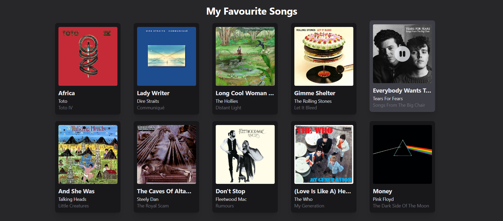

# Songs in React 🎸
And now you learned a little something about me :)
### The Project Set-Up
I set up the project using **Vite**, and installed **TailwindCSS** for styling. I played around with the favicon as well, which I got from https://icons8.com/icons/set/music--style-pin  
The song data is found in the *songs.json* file.

### Styling
I think it's obvious where the design style inspiration came from - **Spotify**. I played around with TailwindCSS to style the cards and display them in a 2x5 grid. The *play* and *pause* icons are from **Bootstrap Icons** (I used the svg element code). This was the main styling (before adding the play logic):

