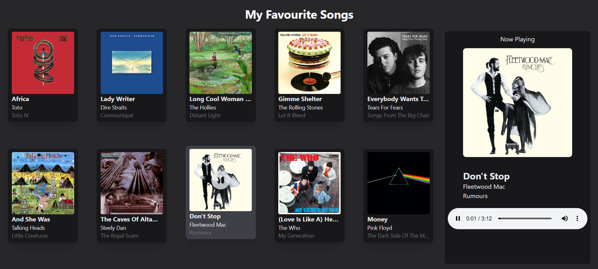

# Songs in React 🎸
### Project Set-Up
I set up the project using **Vite**, and installed **TailwindCSS** for styling. I played around with the favicon as well, which I got from https://icons8.com/icons/set/music--style-pin  
The song data is found in the *songs.json* file.

### Components
The entire project consists of 4 components: *Card, CardsContainer, NowPlaying and Display*.
#### Card
The Card component displays an individual song with its title, artist, album and album cover. It handles selection and gets 6 props: title, artist, album, image, onSelect and isSelected.
#### CardsContainer
The CardsContainer component displays all the cards in a 2x5 grid and handles single-selection logic. It uses selectedIndex from the Display component to track which card is currently selected. It gets 3 props: an array of songs, selectedIndex and setSelectedIndex.
#### NowPlaying
The NowPlaying component gets a single prop - a song - and is only displayed if there is a song selected. It displays the selected song's data, as well as the audio, so it plays. For this project I only had three of the songs downloaded, which I kept in an *audio* folder inside *public* folder (but I didn't push it into the repository). Therefore, if the song *has* the audio file, it plays, otherwise it just displays "Audio not available".
#### Display
The Display is a parent component for CardsContainer and NowPlaying, allowing me to achieve that layout and pass in the props to the child components.

### Styling
I think it's obvious where the design style inspiration came from - **Spotify**. I played around with TailwindCSS to style the cards and display them in a 2x5 grid. The *play* and *pause* icons are from **Bootstrap Icons** (I used the svg element code). This was the main styling (before adding the play logic):

### Issues and possible improvements
- While basic playback works, I haven’t customized the <audio> element’s appearance yet. Tailwind doesn’t directly support styling native audio controls, so improving this might require a custom audio player or third-party library.  
- Currently, clicking a song toggles its selection — but does not toggle playback. Clicking the same song again simply hides the "Now Playing" section instead of pausing it.
- When switching from one song to another, the newly selected song doesn't start playing automatically. This likely stems from the browser not recognizing the <audio> source change as a trigger to restart playback.

